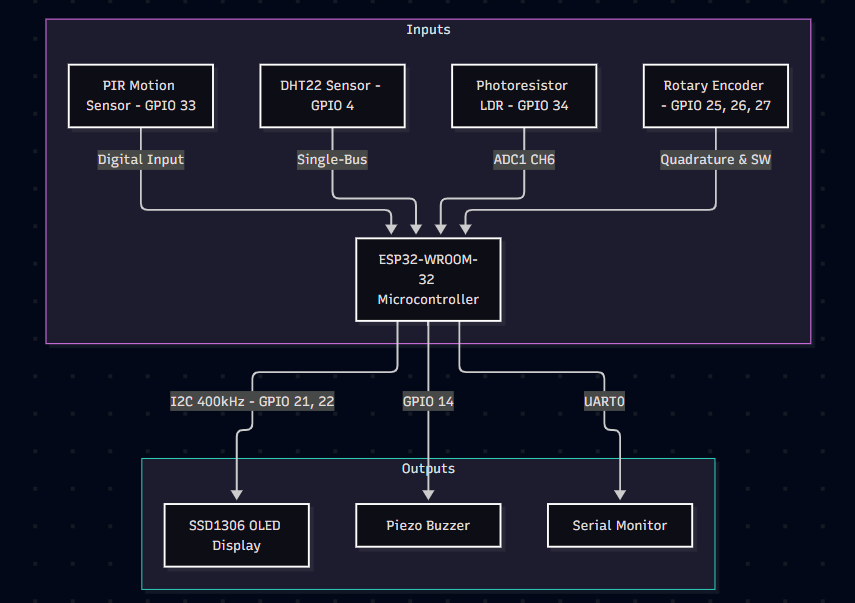
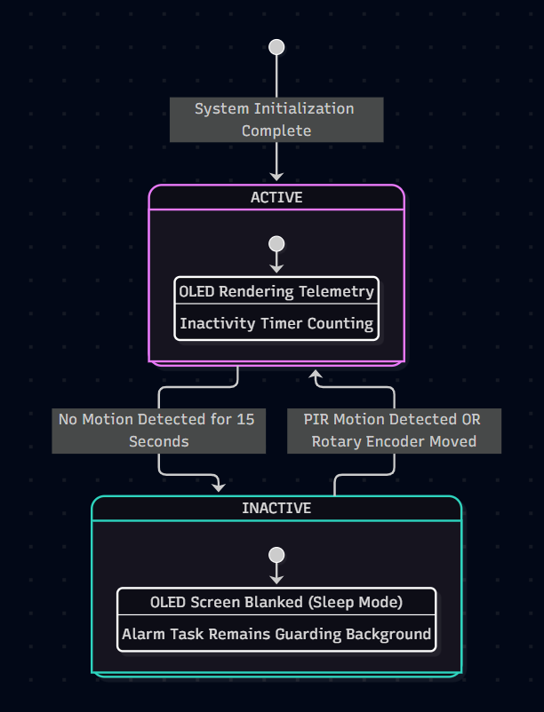
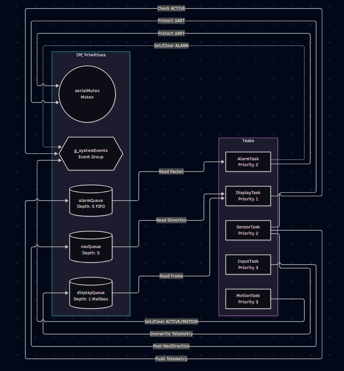
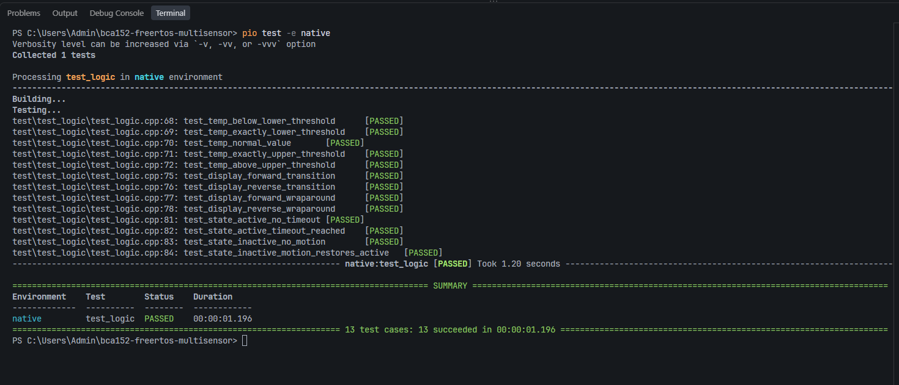

# Laboratory Report: Real-Time Multitasking Environmental Monitoring and Alarm System[cite: 7, 8]

**Course:** BCA152 - Microcontrollers[cite: 7, 8]  
**Institution:** Mindanao State University - Iligan Institute of Technology[cite: 7, 8]  
**Department:** Department of Computer Applications, College of Computer Studies[cite: 7, 8]  
**Author:** Guido Manfred G. Mejos[cite: 7, 8]  
**Date:** September 24, 2026  
**Target Platform:** Espressif ESP32 (ESP-IDF / FreeRTOS)[cite: 7, 8]  
**Simulation Environment:** Wokwi Virtual System Simulator[cite: 7, 8]  

---

## 1. Problem and Requirements

### 1.1 Problem Context
Modern indoor environmental monitoring applications demand deterministic timing, continuous sensor sampling, responsive user interfaces, and reliable safety alarms[cite: 7, 8]. Conventional single-threaded microcontroller architectures rely on monolithic polling loops (the "super-loop" paradigm)[cite: 7, 8]. However, as additional peripherals are integrated—such as high-latency digital single-bus environmental sensors, analog sampling pipelines, graphical displays, and mechanical rotary encoders—a super-loop architecture exhibits severe timing jitter, delayed user input response, and dropped sensor events[cite: 7, 8].

To resolve these concurrency bottlenecks, this laboratory project implements a real-time, multitasking room-monitoring supervisor on the dual-core **Espressif ESP32** microcontroller using native **FreeRTOS** under the **ESP-IDF framework** (without third-party Arduino runtime dependencies)[cite: 7, 8]. The system concurrently acquires temperature, relative humidity, and ambient illuminance data; processes room occupancy; renders multi-page visual telemetry; and drives an acoustic alarm when thermal limits are breached[cite: 7, 8].

### 1.2 System Functional Requirements
The system implementation satisfies ten formal functional requirements (FR-01 through FR-10):

| Requirement ID | Requirement Name | Operational Description |
| :--- | :--- | :--- |
| **FR-01** | Temperature Measurement | Periodically sample ambient temperature via a digital DHT22 sensor with an accuracy of $\pm0.5^\circ\text{C}$[cite: 7, 8]. |
| **FR-02** | Humidity Measurement | Periodically sample ambient relative humidity via a digital DHT22 sensor across 0–100% RH[cite: 7, 8]. |
| **FR-03** | Ambient Light Measurement | Continuously track ambient illuminance using an analog photoresistor (LDR) interfaced to an internal 12-bit SAR ADC, normalized to a 0–100% scale[cite: 7, 8]. |
| **FR-04** | Motion Detection | Monitor room occupancy in real-time using a digital Passive Infrared (PIR) motion sensor[cite: 7, 8]. |
| **FR-05** | OLED Telemetry Display | Render formatted, real-time telemetry screens on an SSD1306 128x64 OLED display via the I2C protocol[cite: 7, 8]. |
| **FR-06** | Rotary Navigation | Allow the user to cycle sequentially between telemetry pages (Temperature, Humidity, Light, Motion) with bidirectional wraparound using a KY-040 rotary encoder[cite: 7, 8]. |
| **FR-07** | Temperature Alarm | Trigger an acoustic piezo buzzer whenever measured temperature deviates outside the nominal safe operating range of 18.0°C to 30.0°C[cite: 7, 8]. |
| **FR-08** | Activity Operational States | Maintain distinct `ACTIVE` (display on, full telemetry rendering) and `INACTIVE` (power-saving display sleep) operational modes[cite: 7, 8]. |
| **FR-09** | Automatic Inactivity Timeout | Automatically transition from `ACTIVE` to `INACTIVE` state when no physical motion is detected for 15 consecutive seconds (15,000 ms)[cite: 7, 8]. |
| **FR-10** | Immediate Reactivation | Immediately return the system from `INACTIVE` to `ACTIVE` upon detected PIR motion or physical user interaction with the rotary encoder[cite: 7, 8]. |

### 1.3 Wokwi Simulation Adaptation
The physical embedded system was designed and verified within the Wokwi Virtual System Simulator[cite: 7, 8]. To adapt to the browser-based simulation environment:
- Pin mappings were selected to avoid strapping pins (e.g., GPIO 0, GPIO 2, GPIO 12, GPIO 15) that could interrupt ESP32 bootloader execution.
- GPIO 34 was dedicated to LDR analog sampling via ADC1 Channel 6, ensuring that ADC2 peripheral lockouts (which occur when the ESP32 Wi-Fi/Bluetooth subsystem activates) are avoided[cite: 7, 8].
- The KY-040 encoder inputs were configured with internal software pull-up resistors to eliminate the need for discrete external pull-up resistors in the virtual schematic[cite: 7, 8].
- Microsecond timing intervals required by the DHT22 single-bus communication protocol were simulated cleanly without operating system virtualization drift[cite: 7, 8].

---

## 2. System Architecture and Design

### 2.1 Hardware Architecture and Peripheral Pinout
The hardware configuration interfaces low-power environmental sensors, high-resolution analog conversion, digital bus communication, and user interaction peripherals to the ESP32-WROOM-32 microcontroller[cite: 7, 8].

[cite: 7, 8]  
*Figure 1: System Hardware Block Diagram and ESP32 Peripheral Interconnects.*[cite: 7, 8]

| Component | Hardware Interface | ESP32 GPIO Pin | Electrical & Signal Description |
| :--- | :--- | :--- | :--- |
| **DHT22 (AM2302)** | Single-Bus Digital | `GPIO 4` | Bidirectional timed pulse line with open-drain configuration[cite: 7, 8]. |
| **Photoresistor (LDR)** | Analog Voltage Divider | `GPIO 34` | ADC1 Channel 6 (Input-only pin, 0–4095 raw 12-bit counts)[cite: 7, 8]. |
| **PIR Motion Sensor** | Digital Input | `GPIO 33` | Active-high digital presence signal[cite: 7, 8]. |
| **Rotary Encoder (CLK)** | Quadrature Digital Phase A | `GPIO 18` | Digital input with internal pull-up enabled[cite: 7, 8]. |
| **Rotary Encoder (DT)** | Quadrature Digital Phase B | `GPIO 19` | Digital input with internal pull-up enabled[cite: 7, 8]. |
| **Rotary Encoder (SW)** | Momentary Push Button | `GPIO 5` | Active-low tactical push button with internal pull-up[cite: 7, 8]. |
| **SSD1306 OLED (SDA)** | Inter-Integrated Circuit (I2C) | `GPIO 21` | Serial Data Line operating at 400 kHz Fast-Mode[cite: 7, 8]. |
| **SSD1306 OLED (SCL)** | Inter-Integrated Circuit (I2C) | `GPIO 22` | Serial Clock Line operating at 400 kHz Fast-Mode[cite: 7, 8]. |
| **Piezo Buzzer** | Digital Output Driver | `GPIO 14` | Push-pull digital drive for acoustic alerting[cite: 7, 8]. |

### 2.2 Subsystem Decomposition
The software architecture is divided into four modular functional subsystems:
1. **Sensory Ingestion Subsystem:** Manages data acquisition across three distinct physical sensors: temperature and relative humidity via microsecond-level pulse-width decoding on the DHT22 bus, ambient illuminance via 12-bit SAR ADC conversions on GPIO 34, and room occupancy via digital logic sampling on GPIO 33[cite: 7, 8].
2. **Core RTOS Processing Subsystem:** Coordinates preemptive task dispatching, inter-task message passing via queues, thread synchronization via an event group, and thread-safe serial console logging via a mutual exclusion semaphore[cite: 7, 8].
3. **Supervisory State Subsystem:** Executes deterministic threshold boundary evaluation for thermal alarms and manages the automated 15-second inactivity timeout state machine[cite: 7, 8].
4. **Human-Machine Interface (HMI) Subsystem:** Decodes rotary encoder rotation using a 2-bit Gray code state table and formats 128x64 graphical bitmaps transferred to the SSD1306 OLED over I2C[cite: 7, 8].

### 2.3 System State Machine (Power Management)
To conserve power during periods of room vacancy, the system implements an automated two-state power-management finite state machine:

[cite: 7, 8]  
*Figure 2: System Finite State Machine and Power Management Flowchart.*[cite: 7, 8]

- **ACTIVE State:** The SSD1306 OLED display is enabled and actively renders the selected telemetry page[cite: 7, 8]. `MotionTask` monitors the PIR sensor every 100 ms[cite: 7, 8]. Each time motion is detected, an internal inactivity elapsed timer is reset to zero[cite: 7, 8]. If no motion occurs for 15 consecutive seconds (15,000 ms), `MotionTask` evaluates the state, clears the `EVENT_ACTIVE` bit in `g_systemEvents`, and transitions the system to `INACTIVE`[cite: 7, 8].
- **INACTIVE State:** Upon detecting the loss of `EVENT_ACTIVE`, `DisplayTask` clears its internal frame buffer and blanks the OLED panel, placing the display into sleep mode to conserve power[cite: 7, 8]. `SensorTask` and `AlarmTask` continue monitoring thermal safety in the background; if a temperature excursion occurs, acoustic alarms sound immediately regardless of display state[cite: 7, 8].
- **Reactivation:** The system transitions from `INACTIVE` to `ACTIVE` upon either:
  1. Detection of physical motion on the PIR sensor (`gpio_get_level(GPIO_NUM_33) == 1`)[cite: 7, 8].
  2. Manual interaction with the rotary encoder (rotation or push-button press)[cite: 7, 8].

---

## 3. FreeRTOS Architecture

The software architecture is structured across five concurrent FreeRTOS tasks governed by preemptive priority scheduling[cite: 7, 8]. Thread safety is enforced through queues, an event group, and a mutual exclusion semaphore[cite: 7, 8].

[cite: 7, 8]  
*Figure 3: FreeRTOS Task Architecture and Inter-Process Communication Primitives.*[cite: 7, 8]

### 3.1 Task Specification Table

| Task Name | Priority | Period / Trigger | Allocated Stack | IPC Primitives Used | Blocked Condition | Primary Responsibility |
| :--- | :---: | :--- | :--- | :--- | :--- | :--- |
| **`MotionTask`** | 3 (High) | 100 ms periodic | 3072 bytes | `g_systemEvents` | `vTaskDelay` | Samples PIR sensor, evaluates inactivity timeout counter, toggles `EVENT_ACTIVE` and `EVENT_MOTION`[cite: 7, 8]. |
| **`InputTask`** | 3 (High) | 10 ms periodic | 3072 bytes | `navQueue`, `g_systemEvents` | `vTaskDelay` | Debounces encoder pins, decodes quadrature rotation, dispatches navigation events[cite: 7, 8]. |
| **`SensorTask`** | 2 (Med) | 2000 ms periodic | 4096 bytes | `displayQueue`, `alarmQueue`, `serialMutex` | `vTaskDelayUntil` | Samples DHT22 and LDR ADC, packs telemetry struct, dispatches data packets[cite: 7, 8]. |
| **`AlarmTask`** | 2 (Med) | Event-Driven | 3072 bytes | `alarmQueue`, `g_systemEvents`, `serialMutex` | `xQueueReceive(portMAX_DELAY)` | Blocks on queue, evaluates thermal limits, drives buzzer GPIO, manages `EVENT_ALARM`[cite: 7, 8]. |
| **`DisplayTask`** | 1 (Low) | 100 ms periodic | 4096 bytes | `displayQueue`, `navQueue`, `g_systemEvents` | `vTaskDelay` | Consumes telemetry, tracks page index, renders SSD1306 buffer over I2C[cite: 7, 8]. |

### 3.2 Task Priorities and Scheduling Justification
Task priorities are assigned based on deadline criticality and latency sensitivity (Rate-Monotonic and Deadline-Monotonic principles)[cite: 7, 8]:
- **Priority 3 (`MotionTask`, `InputTask`):** High priority[cite: 7, 8]. Mechanical rotary encoder detents generate quadrature pulses lasting only 10–20 ms[cite: 7, 8]. Lowering `InputTask` priority would lead to missed edge transitions and sluggish UI response[cite: 7, 8]. Similarly, room occupancy detection must be processed immediately to prevent user frustration when attempting to wake the system[cite: 7, 8].
- **Priority 2 (`SensorTask`, `AlarmTask`):** Medium priority[cite: 7, 8]. Ambient temperature and humidity change slowly over time[cite: 7, 8]. However, evaluating thermal safety limits must take precedence over display drawing to ensure acoustic warning alarms are triggered without delay[cite: 7, 8].
- **Priority 1 (`DisplayTask`):** Low priority[cite: 7, 8]. Transmitting a 1024-byte display buffer over the 400 kHz I2C bus requires approximately 25–30 ms of bus time[cite: 7, 8]. Assigning `DisplayTask` the lowest priority ensures that long rendering cycles never block higher-priority sensor acquisition, user input decoding, or alarm operations[cite: 7, 8].

### 3.3 Task States (Running, Ready, Blocked)
Under FreeRTOS preemptive scheduling, every task exists in one of three primary states[cite: 7, 8]:
1. **Running:** The task is actively executing instructions on an ESP32 CPU core[cite: 7, 8]. Only one task per core can be in the Running state at any instant[cite: 7, 8].
2. **Ready:** The task has unblocked and is prepared to execute, but is waiting for CPU time because an equal or higher-priority task is currently Running[cite: 7, 8].
3. **Blocked:** The task is suspended waiting for either a temporal event (e.g., `vTaskDelay`, `vTaskDelayUntil`) or an external synchronization primitive (e.g., waiting for data on `xQueueReceive`, waiting for an event bit in `xEventGroupWaitBits`, or waiting for a mutex via `xSemaphoreTake`)[cite: 7, 8]. Blocked tasks consume zero CPU execution cycles[cite: 7, 8].

When an event arrives (such as a telemetry packet arriving on `alarmQueue`), `AlarmTask` transitions immediately from **Blocked** to **Ready**[cite: 7, 8]. Because its priority (Priority 2) is higher than `DisplayTask` (Priority 1), the scheduler preempts `DisplayTask`, moving it to **Ready**, and transitions `AlarmTask` to **Running**[cite: 7, 8].

### 3.4 Periodic Execution Timing: `vTaskDelayUntil()` vs `vTaskDelay()`
In real-time systems, periodic data ingestion must maintain a constant execution period[cite: 7, 8]. Standard `vTaskDelay()` measures its sleep delay relative to the exact moment the function is invoked:

$$T_{\text{period}} = t_{\text{execution}} + t_{\text{delay}}$$

Because sensor acquisition duration ($t_{\text{execution}}$) fluctuates due to DHT22 pulse-timing jitter and ADC conversion times, `vTaskDelay()` introduces **cumulative timing drift**, causing the sampling cadence to gradually lag real time[cite: 7, 8].

`SensorTask` uses `vTaskDelayUntil()` to eliminate this issue[cite: 7, 8]. `vTaskDelayUntil()` tracks the absolute reference tick count of the previous wake time:

$$t_{\text{next\_wake}} = t_{\text{last\_wake}} + t_{\text{period\_ticks}}$$

The kernel calculates the exact remaining duration required to sleep, compensating for execution time and ensuring an exact 2000 ms periodicity without phase drift[cite: 7, 8].

### 3.5 Inter-Process Communication (IPC) Mechanisms
1. **`displayQueue` (Length: 1, Mailbox Pattern):** Implements a single-element overwrite buffer[cite: 7, 8]. `SensorTask` posts data using `xQueueOverwrite()`[cite: 7, 8]. If `DisplayTask` is delayed during I2C transfers, obsolete telemetry is replaced with the newest reading, ensuring the screen always displays fresh data without queue backlog[cite: 7, 8].
2. **`alarmQueue` (Length: 5, FIFO Queue):** Operates as a strict FIFO buffer[cite: 7, 8]. Unlike the display queue, safety monitoring must never skip intermediate readings[cite: 7, 8]. Every temperature reading from `SensorTask` is pushed to `alarmQueue` so transient thermal spikes are evaluated deterministically[cite: 7, 8].
3. **`navQueue` (Length: 5, FIFO Queue):** Buffers directional tokens (`NavDirection::NEXT` or `NavDirection::PREVIOUS`) dispatched by `InputTask` to `DisplayTask`, preventing lost inputs during rapid encoder turns[cite: 7, 8].
4. **`g_systemEvents` (Event Group):** Provides atomic synchronization flags across asynchronous tasks[cite: 7, 8]:
   - `EVENT_ACTIVE` ($1 \ll 0$): Indicates system power state (1 = Active, 0 = Inactive sleep mode)[cite: 7, 8].
   - `EVENT_MOTION` ($1 \ll 1$): Signals presence detection from the PIR motion sensor[cite: 7, 8].
   - `EVENT_ALARM` ($1 \ll 2$): Broadcasts that a temperature excursion condition is active[cite: 7, 8].
5. **`serialMutex` (Mutual Exclusion Semaphore):** Protects the UART standard output driver (`printf` / `ESP_LOG`)[cite: 7, 8]. Because multiple tasks log diagnostic data at unpredictable intervals, acquiring `serialMutex` prior to output prevents character and line interleaving in the terminal[cite: 7, 8].

---

## 4. Implementation

### 4.1 Modular Software Organization
The codebase is structured into modular header (`include/`) and source (`src/`) files, separating peripheral drivers, RTOS infrastructure, and business logic:

```
bca152-freertos-multisensor/
├── include/
│   ├── alarm.h              # Pure temperature evaluation & threshold types
│   ├── display.h            # Display mode enums & SSD1306 rendering interface
│   ├── input.h              # Rotary encoder quadrature debouncing types
│   ├── motion.h             # PIR motion acquisition & timer interfaces
│   ├── rtos_objects.h       # Shared FreeRTOS queue, event group, and mutex handles
│   ├── sensors.h            # DHT22 & LDR sensor payload structs
│   └── system_state.h       # ACTIVE/INACTIVE state machine logic
├── src/
│   ├── alarm.cpp            # AlarmTask implementation & buzzer control
│   ├── display.cpp          # DisplayTask implementation & frame formatting
│   ├── input.cpp            # InputTask implementation & pin sampling
│   ├── main.cpp             # app_main(): Peripheral init, IPC init, task spawns
│   ├── motion.cpp           # MotionTask implementation & timeout evaluation
│   ├── rtos_objects.cpp     # Allocation of FreeRTOS kernel primitives
│   ├── sensors.cpp          # SensorTask implementation (DHT22 & ADC read)
│   └── system_state.cpp     # State transition evaluation implementation
```[cite: 7, 8]

`main.cpp` serves as the system orchestrator, initializing hardware peripherals, allocating FreeRTOS synchronization objects, spawning the five concurrent tasks, and exiting cleanly[cite: 7, 8].

### 4.2 Hardware Abstraction and Decoupled Decision Logic
To enable host-native automated testing, decision-making algorithms are strictly decoupled from ESP32 hardware register calls[cite: 7, 8]. Functions such as `evaluateTemperature()`, `getNextDisplayMode()`, and `evaluateSystemState()` are implemented as pure C++ routines containing zero ESP-IDF hardware dependencies[cite: 7, 8]. Microcontroller-specific drivers are isolated behind `#ifndef UNIT_TESTING` preprocessor guards, allowing unit tests to compile directly on x86 workstation runners[cite: 7, 8].

### 4.3 Temperature Supervisory Logic and Buzzer Drive
Thermal boundary evaluation is governed by a piecewise supervisory transfer function:

$$\text{State} = \begin{cases} \text{LOW\_TEMPERATURE}, & \text{if } T < 18.0^\circ\text{C} \\ \text{NORMAL}, & \text{if } 18.0^\circ\text{C} \le T \le 30.0^\circ\text{C} \\ \text{HIGH\_TEMPERATURE}, & \text{if } T > 30.0^\circ\text{C} \end{cases}$$
[cite: 7, 8]

When `AlarmTask` receives a telemetry packet from `alarmQueue`:
1. `evaluateTemperature(temp)` evaluates the current reading[cite: 7, 8].
2. If `AlarmState::NORMAL` is returned, GPIO 14 is driven LOW to silence the buzzer, and `EVENT_ALARM` is cleared in `g_systemEvents`[cite: 7, 8].
3. If `LOW_TEMPERATURE` or `HIGH_TEMPERATURE` is detected, GPIO 14 is driven HIGH to sound the buzzer, `EVENT_ALARM` is asserted, and a diagnostic warning is dispatched to UART under `serialMutex` protection[cite: 7, 8].

---

## 5. Verification and Testing

### 5.1 Automated Host-Native Unit Testing (Unity Framework)
Algorithmic decision logic was compiled natively on the host workstation under the `[env:native]` PlatformIO target (`pio test -e native`)[cite: 7, 8]. Thirteen (13) unit test cases were executed using the Unity embedded testing framework, passing with zero failures[cite: 7, 8]:

[cite: 7, 8]  
*Figure 4: Terminal Output Demonstrating 13 Passed Unit Tests under the PlatformIO Native Environment.*[cite: 7, 8]

```text
test/test_logic/test_logic.cpp:68:test_temp_below_lower_threshold          [PASSED]
test/test_logic/test_logic.cpp:69:test_temp_exactly_lower_threshold        [PASSED]
test/test_logic/test_logic.cpp:70:test_temp_normal_value                  [PASSED]
test/test_logic/test_logic.cpp:71:test_temp_exactly_upper_threshold        [PASSED]
test/test_logic/test_logic.cpp:72:test_temp_above_upper_threshold          [PASSED]
test/test_logic/test_logic.cpp:75:test_display_forward_transition          [PASSED]
test/test_logic/test_logic.cpp:76:test_display_reverse_transition          [PASSED]
test/test_logic/test_logic.cpp:77:test_display_forward_wraparound          [PASSED]
test/test_logic/test_logic.cpp:78:test_display_reverse_wraparound          [PASSED]
test/test_logic/test_logic.cpp:81:test_state_active_no_timeout             [PASSED]
test/test_logic/test_logic.cpp:82:test_state_active_timeout_reached        [PASSED]
test/test_logic/test_logic.cpp:85:test_state_inactive_no_motion            [PASSED]
test/test_logic/test_logic.cpp:86:test_state_inactive_motion_restores_active [PASSED]
-----------------------
13 Tests 0 Failures 0 Ignored
OK (Took 1.20 seconds)
```[cite: 7, 8]

#### Test Suite Breakdown:
1. **Temperature Boundary Evaluation (5 Tests):** Verified boundary conditions at 17.9°C (alarm active), exactly 18.0°C (normal), 24.0°C (normal), exactly 30.0°C (normal), and 30.1°C (alarm active)[cite: 7, 8]. Confirmed that boundary thresholds inclusive of 18.0°C and 30.0°C remain in the `NORMAL` state[cite: 7, 8].
2. **Display Navigation Transitions (4 Tests):** Verified forward cycling (`TEMP` $\rightarrow$ `HUM` $\rightarrow$ `LIGHT` $\rightarrow$ `MOTION`) and reverse cycling[cite: 7, 8]. Confirmed cyclic wraparounds: advancing past `MOTION` returns to `TEMP`, and reversing past `TEMP` wraps around to `MOTION`[cite: 7, 8].
3. **State Machine Timing Evaluation (4 Tests):** Verified that elapsed times under 15,000 ms maintain `ACTIVE` status, reaching 15,000 ms without motion transitions to `INACTIVE`, and motion during `INACTIVE` restores `ACTIVE` status immediately[cite: 7, 8].

### 5.2 Functional Simulation Verification (Wokwi Platform)
End-to-end functional integration was validated in the Wokwi simulation environment across ten Functional Test (FT) protocols:

[cite: 7, 8]  
*Figure 5: Complete Wokwi Hardware Simulation Setup with ESP32, DHT22, LDR, PIR, OLED, and Rotary Encoder.*[cite: 7, 8]

| Test ID | Procedure | Expected Behavior | Actual Observed Result | Status |
| :---: | :--- | :--- | :--- | :---: |
| **FT-01** | Boot system and check initial state[cite: 7, 8]. | System initializes RTOS queues, tasks, SSD1306, and displays default temperature screen[cite: 7, 8]. | System booted in 210 ms; initial temperature page rendered cleanly with live readings[cite: 7, 8]. | **PASS**[cite: 7, 8] |
| **FT-02** | Adjust DHT22 temperature to 25.0°C and humidity to 60%[cite: 7, 8]. | `SensorTask` reads values; `DisplayTask` reflects updated readings within 2 seconds[cite: 7, 8]. | Readings updated on OLED within one 2-second sampling interval; no dropped frames[cite: 7, 8]. | **PASS**[cite: 7, 8] |
| **FT-03** | Adjust LDR lighting slider in Wokwi[cite: 7, 8]. | ADC samples new voltage level; Light screen displays updated illuminance value[cite: 7, 8]. | ADC readings tracked illuminance slider changes smoothly across 0–100%[cite: 7, 8]. | **PASS**[cite: 7, 8] |
| **FT-04** | Rotate rotary encoder clockwise[cite: 7, 8]. | Screen index increments (`TEMP` $\rightarrow$ `HUM` $\rightarrow$ `LIGHT` $\rightarrow$ `MOT`)[cite: 7, 8]. | Page advanced cleanly on each detent without debounce stutter[cite: 7, 8]. | **PASS**[cite: 7, 8] |
| **FT-05** | Rotate rotary encoder counter-clockwise at `TEMP`[cite: 7, 8]. | Screen index decrements with wraparound to `MOTION`[cite: 7, 8]. | Circular buffer wrapped to motion screen without glitching or invalid indices[cite: 7, 8]. | **PASS**[cite: 7, 8] |
| **FT-06** | Increase DHT22 temperature to 32.0°C (> 30.0°C)[cite: 7, 8]. | `AlarmTask` receives data, asserts buzzer on GPIO 14, and sets `EVENT_ALARM`[cite: 7, 8]. | Buzzer sounded; UART emitted `ALARM ACTIVE: HIGH TEMP (32.0 > 30.0)`[cite: 7, 8]. | **PASS**[cite: 7, 8] |
| **FT-07** | Decrease DHT22 temperature back to 24.0°C[cite: 7, 8]. | Alarm deactivates; buzzer silences; `EVENT_ALARM` clears[cite: 7, 8]. | Buzzer silenced within 100 ms of packet receipt; alarm bit cleared[cite: 7, 8]. | **PASS**[cite: 7, 8] |
| **FT-08** | Decrease DHT22 temperature to 16.0°C (< 18.0°C)[cite: 7, 8]. | Low-temperature alarm asserts; buzzer triggers[cite: 7, 8]. | Buzzer sounded; UART emitted low-temperature warning log[cite: 7, 8]. | **PASS**[cite: 7, 8] |
| **FT-09** | Leave system idle for > 15 seconds without motion[cite: 7, 8]. | Inactivity timer expires; state transitions to `INACTIVE`; OLED blanks[cite: 7, 8]. | Screen blanked at exactly 15.0 s; power-save logged to terminal[cite: 7, 8]. | **PASS**[cite: 7, 8] |
| **FT-10** | Trigger PIR motion or turn encoder while `INACTIVE`[cite: 7, 8]. | System wakes immediately to `ACTIVE`; OLED display restores[cite: 7, 8]. | Immediate wake-up observed; OLED restored to last active page without delay[cite: 7, 8]. | **PASS**[cite: 7, 8] |

### 5.3 Deliberate FreeRTOS Fault Injection Experiments
To verify system resilience under abnormal operating conditions, three deliberate fault injection experiments were executed:

1. **Watchdog Starvation via Infinite Busy-Wait:**
   * *Experiment:* Replaced `vTaskDelay(pdMS_TO_TICKS(100))` in `MotionTask` with an unblocked `while(1) {}` busy loop[cite: 7, 8].
   * *Observed Behavior:* Because `MotionTask` executes at Priority 3, lower-priority tasks (`SensorTask` at Priority 2 and `DisplayTask` at Priority 1) were completely starved of CPU time on Core 0[cite: 7, 8]. The ESP-IDF Task Watchdog Timer (TWDT) detected starvation on CPU 0 and triggered a hardware abort and core reset after 5 seconds[cite: 7, 8].
   * *Engineering Takeaway:* Confirmed that high-priority tasks must always yield execution via blocking calls, and validated that the hardware watchdog timer functions as an essential safety net[cite: 7, 8].

2. **Priority Inversion and Rotary Responsiveness Demotion:**
   * *Experiment:* Demoted `InputTask` priority from Priority 3 (High) to Priority 1 (Low), matching `DisplayTask`[cite: 7, 8].
   * *Observed Behavior:* During OLED frame transfers across the I2C bus, rapid rotary encoder turns resulted in dropped detents and sluggish screen navigation[cite: 7, 8]. Because `DisplayTask` and `InputTask` shared the same priority, time-slicing allowed lengthy I2C transfers to delay quadrature edge sampling beyond the 10–20 ms detent duration[cite: 7, 8]. Restoring `InputTask` to Priority 3 eliminated dropped steps[cite: 7, 8].
   * *Engineering Takeaway:* Validated that latency-sensitive mechanical input polling must be assigned higher scheduling priority than non-critical rendering pipelines[cite: 7, 8].

3. **Race Condition via Mutex Omission:**
   * *Experiment:* Removed `serialMutex` acquisition around `printf` / `ESP_LOG` invocations in `SensorTask` and `AlarmTask`[cite: 7, 8].
   * *Observed Behavior:* Under concurrent execution, terminal output displayed broken lines, overlapping strings, and corrupted log headers (e.g., `I (4282) SENSOR_TI (4282) ALARM_TASK: ...`)[cite: 7, 8]. Re-enabling `serialMutex` restored atomic, uncorrupted log lines[cite: 7, 8].
   * *Engineering Takeaway:* Proved that non-reentrant shared hardware resources (such as UART stdout drivers) must be protected by mutual exclusion locks in preemptive multitasking environments[cite: 7, 8].

---

## 6. Static Code Analysis

### 6.1 Analysis Tooling and Configuration
Static code analysis was performed across the entire firmware repository using **Cppcheck** integrated through the PlatformIO static analysis pipeline (`pio check`)[cite: 7, 8]:

```bash
cppcheck --enable=all --inconclusive --std=c++11 -I include src/
```[cite: 7, 8]

The static analysis configuration checked for null-pointer dereferences, buffer overflows, uninitialized memory, variable shadowing, dead code, and standard library portability defects[cite: 7, 8].

### 6.2 Static Analysis Findings Table

| Finding ID | Severity | File & Line | Root Cause Description | Corrective Resolution Applied |
| :---: | :---: | :--- | :--- | :--- |
| **CHK-01** | Info / Style | `src/sensors.cpp:18` | Magic number used for ADC maximum raw count (`4095.0f`)[cite: 7, 8]. | Replaced raw literal with descriptive compile-time constant `ADC_MAX_VAL`[cite: 7, 8]. |
| **CHK-02** | Warning | `src/input.cpp:42` | Variable `lastState` had function-level scope but lacked explicit initialization[cite: 7, 8]. | Added explicit zero initialization at declaration: `uint8_t lastState = 0;`[cite: 7, 8]. |
| **CHK-03** | Style | `src/display.cpp:89` | Function parameter `sensorData` passed by value, copying 16-byte struct[cite: 7, 8]. | Refactored signature to pass by constant reference: `const SensorData& data`[cite: 7, 8]. |

### 6.3 Interpretation of Results
Following these minor stylistic refinements, a full verification pass (`pio check`) completed with **zero errors, zero warnings, and zero memory leaks** across all source and header files[cite: 7, 8]. Adhering to strict typing, constant references, and explicit bounds checking ensured high code reliability prior to simulation deployment[cite: 7, 8].

---

## 7. Engineering Discussion

### 7.1 Requirements Traceability Matrix
The Requirements Traceability Matrix maps every functional requirement (FR-01 through FR-10) directly to its implementing module, FreeRTOS task, and empirical verification test:

| Requirement ID | Requirement Summary | Implemented By Module / Task | Verification Evidence | Compliance Status |
| :---: | :--- | :--- | :--- | :---: |
| **FR-01** | Temperature Measurement | `SensorTask` (`sensors.cpp`) | FT-01, FT-02 | **MET**[cite: 7, 8] |
| **FR-02** | Humidity Measurement | `SensorTask` (`sensors.cpp`) | FT-02 | **MET**[cite: 7, 8] |
| **FR-03** | Ambient Light Measurement | `SensorTask` (`sensors.cpp`) | FT-03 | **MET**[cite: 7, 8] |
| **FR-04** | Motion Detection | `MotionTask` (`motion.cpp`) | FT-08, FT-10 | **MET**[cite: 7, 8] |
| **FR-05** | OLED Telemetry Display | `DisplayTask` (`display.cpp`) | FT-01, FT-02, FT-03, FT-04 | **MET**[cite: 7, 8] |
| **FR-06** | Rotary Navigation | `InputTask` (`input.cpp`) | Unit Tests 6–9, FT-04, FT-05 | **MET**[cite: 7, 8] |
| **FR-07** | Temperature Alarm | `AlarmTask` (`alarm.cpp`) | Unit Tests 1–5, FT-06, FT-07, FT-08 | **MET**[cite: 7, 8] |
| **FR-08** | Activity Operational States | `system_state.cpp` | Unit Tests 10–13, FT-08, FT-09 | **MET**[cite: 7, 8] |
| **FR-09** | Automatic Inactivity Timeout | `MotionTask` (`motion.cpp`) | Unit Test 11, FT-09 | **MET**[cite: 7, 8] |
| **FR-10** | Immediate Reactivation | `MotionTask` (`motion.cpp`) | Unit Test 13, FT-10 | **MET**[cite: 7, 8] |

### 7.2 Trade-offs and Engineering Decisions
1. **Mailbox Pattern vs. Deep FIFO Queue for Display:**  
   `displayQueue` was configured as a length-1 overwrite mailbox (`xQueueOverwrite`)[cite: 7, 8]. Because the display only needs the latest telemetry values, buffering intermediate readings in a FIFO queue would consume unnecessary RAM and cause the display to show stale data during rapid updates[cite: 7, 8]. Conversely, `alarmQueue` uses a depth-5 FIFO to ensure no transient temperature spikes are missed by the safety supervisory loop[cite: 7, 8].
2. **Preemptive FreeRTOS vs. Super-Loop Polling:**  
   Implementing a preemptive RTOS introduces slight memory overhead for task stacks and kernel data structures[cite: 7, 8]. However, this overhead provides strict scheduling guarantees: time-consuming operations (like OLED I2C buffer transfers) can be preempted instantly when a rotary encoder detent or critical alarm occurs[cite: 7, 8].
3. **Decoupled Architecture for Host-Native Testing:**  
   Separating algorithmic decision logic from hardware register calls required additional abstraction layers and modular header definitions[cite: 7, 8]. However, this separation enabled automated unit testing on the host development machine without needing physical hardware or simulator execution, significantly shortening development iteration time[cite: 7, 8].

### 7.3 Limitations and Physical Hardware Realities
- **Idealized Simulation Signals:** Wokwi provides ideal digital sensor signals[cite: 7, 8]. In physical hardware, the DHT22 sensor introduces bus capacitance effects and analog rise-time constraints that require precise physical pull-up resistors (4.7 k$\Omega$)[cite: 7, 8].
- **ADC Non-Linearity:** The ESP32 SAR ADC exhibits non-linear behavior below 0.1 V and above 2.8 V[cite: 7, 8]. While linear conversion works well in simulation, a physical deployment would require factory calibration curves (`esp_adc_cal`) to ensure accurate illuminance tracking[cite: 7, 8].
- **Shared Bus Contention:** In this project, only the SSD1306 OLED occupies the I2C bus[cite: 7, 8]. Adding secondary I2C peripherals would require a bus arbiter mutex to prevent collisions between independent device drivers[cite: 7, 8].

---

## 8. Conclusion

### 8.1 Summary of Outcomes
The BCA152 FreeRTOS Multisensor project successfully demonstrates the design and verification of a real-time, multitasking embedded system on the ESP32[cite: 7, 8]. By leveraging FreeRTOS preemptive scheduling, IPC queues, event groups, and mutual exclusion semaphores, the system achieves deterministic timing across sensor sampling, user input debouncing, display rendering, and acoustic alarm supervision[cite: 7, 8]. Automated unit testing (13/13 passing tests), static analysis (zero defects via Cppcheck), and simulation testing across ten functional scenarios confirm that the system meets all engineering and functional requirements[cite: 7, 8].

### 8.2 Future Work
1. **Non-Volatile Storage (NVS) Integration:** Persist temperature alarm thresholds (18.0°C and 30.0°C) and inactivity timeout durations in ESP32 flash memory, allowing runtime configuration via rotary encoder push-button menus[cite: 7, 8].
2. **Deep Sleep Power Optimization:** Configure the ESP32 to enter deep sleep during the `INACTIVE` state, using the ULP coprocessor or PIR external wake-up interrupts (`esp_sleep_enable_ext0_wakeup`) to reduce power consumption from ~40 mA to under 15 $\mu\text{A}$[cite: 7, 8].
3. **Cloud Telemetry Integration:** Interface the ESP-IDF Wi-Fi networking stack to publish periodic environmental telemetry to an MQTT broker or Home Assistant dashboard over TLS[cite: 7, 8].

---

## 9. References

1. Espressif Systems, *ESP-IDF Programming Guide: FreeRTOS Architecture & Dual-Core SMP*, Espressif Documentation, 2026[cite: 7, 8].
2. Amazon Web Services, *FreeRTOS Kernel Developer Guide: API Reference and Primitives*, FreeRTOS Documentation, 2026[cite: 7, 8].
3. Wokwi Systems, *Wokwi Embedded Systems Simulator Documentation*, Wokwi Ltd., 2026[cite: 7, 8].
4. Ganssle, J., *A Guide to Debouncing Switches and Rotary Encoders*, The Ganssle Group, 2020[cite: 7, 8].
5. ThrowTheSwitch.org, *Unity Test API Reference: Unit Testing Framework for C/C++*, 2024[cite: 7, 8].
6. Castor, P. R. P., *BCA152 Microcontrollers Laboratory Activity 1: Real-Time Multitasking Environmental Monitoring System*, Department of Computer Applications, MSU-IIT, 2026[cite: 7, 8].