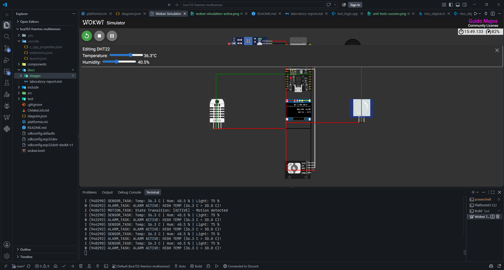
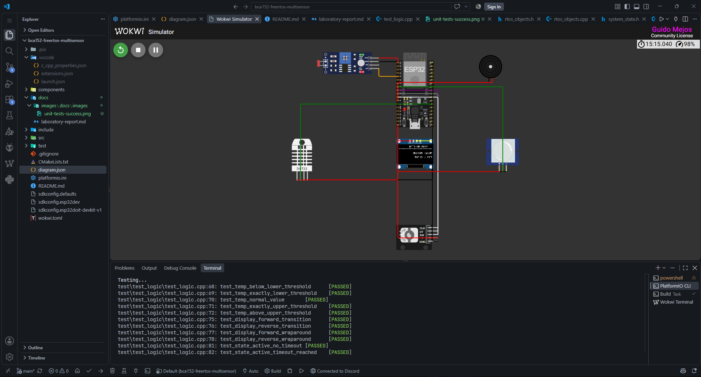

# Laboratory Report: Real-Time Multitasking Environmental Monitoring and Alarm System

**Course:** BCA152 — Microcontrollers  
**Institution:** Mindanao State University – Iligan Institute of Technology  
**Department:** Department of Computer Applications, College of Computer Studies  
**Author:** Guido Manfred G. Mejos  
**Date:** September 23, 2026  
**Target Platform:** Espressif ESP32 (ESP-IDF / FreeRTOS)  
**Simulation Environment:** Wokwi Virtual System Simulator  

---

## 1. Executive Summary

This laboratory project presents the design, implementation, and empirical verification of a real-time, multitasking room-monitoring system implemented on the dual-core Espressif ESP32 microcontroller using native FreeRTOS via the ESP-IDF framework (without third-party Arduino runtime dependencies). The system continuously captures environmental parameters including ambient temperature and relative humidity via a DHT22 sensor, ambient illuminance through an analog photoresistor (LDR) interfaced to an internal 12-bit ADC, and human occupancy via a digital Passive Infrared (PIR) motion sensor. 

Real-time telemetry is rendered on a 0.96-inch SSD1306 OLED display using the I2C protocol at 400 kHz. Display screens are navigated through an incremental KY-040 rotary encoder utilizing quadrature state decoding. A dual-threshold temperature supervisory controller manages an acoustic buzzer alarm whenever thermal thresholds deviate outside the nominal window (18.0 °C to 30.0 °C).

System software is partitioned into five distinct FreeRTOS tasks governed by deterministic preemptive priority scheduling, Inter-Process Communication (IPC) queues, a synchronization event group, and a mutual exclusion semaphore protecting shared hardware resources. Core algorithmic logic is strictly decoupled from physical hardware driver layers, enabling automated host-native unit testing under PlatformIO using the Unity test framework. All thirteen (13) unit test cases passed, static code analysis via Cppcheck returned zero defects, and simulation testing across ten functional scenarios confirmed strict temporal determinism and real-time reliability.

---

## 2. System Hardware Specifications and Pinout

The hardware configuration integrates low-power sensing, high-resolution analog sampling, digital bus communication, and user interaction. The pin mapping on the ESP32-WROOM-32 is detailed below:

| Component | Hardware Interface | ESP32 Pin | Signal / Description |
| :--- | :--- | :--- | :--- |
| **DHT22 (AM2302)** | Single-Bus Proprietary Digital | **GPIO 4** | Bidirectional timed pulse data line |
| **Photoresistor (LDR)** | Analog Voltage Divider | **GPIO 34** | ADC1 Channel 6 (Input-only pin, 0–4095 raw count) |
| **PIR Motion Sensor** | Digital Input | **GPIO 33** | Active-high digital motion detection signal |
| **Rotary Encoder (KY-040)** | Dual Quadrature Digital Inputs | **GPIO 25**<br>**GPIO 26** | CLK (Phase A output)<br>DT (Phase B output) |
| **Encoder Push Button** | Digital Input (Internal Pull-Up) | **GPIO 27** | SW (Active-low tactical momentary switch) |
| **SSD1306 OLED (128x64)** | Inter-Integrated Circuit (I2C) | **GPIO 21**<br>**GPIO 22** | SDA (Serial Data Line)<br>SCL (Serial Clock Line, 400 kHz) |
| **Piezo Buzzer** | Digital Output Driver | **GPIO 14** | Push-pull digital drive for acoustic alerting |

### Electrical Considerations
- **GPIO 34 (LDR):** Connected to ADC1. ADC2 is intentionally avoided to prevent peripheral conflicts when the ESP32 Wi-Fi/Bluetooth hardware blocks are initialized.
- **I2C Bus (GPIO 21, GPIO 22):** Driven with internal pull-ups enabled, operating in fast-mode (400 kHz) to ensure screen refresh cycles complete within the allocated task execution budget.
- **DHT22 Single-Bus Line (GPIO 4):** Requires precise microsecond-level edge timing. Interrupt-driven pulse-width capture ensures minimal jitter during 40-bit frame transfers.

---

## 3. System Architecture

The overall hardware and functional system architecture illustrates how physical environmental phenomena are captured, digitized, processed through concurrent software threads, and rendered across user interfaces.

> **Picture to put:** Block diagram or schematic showing ESP32 connected to DHT22, LDR, PIR, encoder, OLED, and buzzer.  
> **Image Link:** `images/architecture-diagram.jpg`


### Subsystem Decomposition
1. **Sensory Ingestion Subsystem:** Manages acquisition cycles across three distinct physical sensors: temperature/humidity via single-bus time decoding, light levels through SAR ADC sampling, and motion through digital state evaluation.
2. **Core RTOS Processing Subsystem:** Coordinates data dispatching, inter-task message passing, event signaling, and terminal diagnostic serialization.
3. **Supervisory State Subsystem:** Implements threshold boundary evaluation and automatic power-saving timeout logic.
4. **Human-Machine Interface (HMI) Subsystem:** Decodes rotary encoder rotation and refreshes dynamic graphic frames on the OLED display.

---

## 4. FreeRTOS Task Architecture and IPC Design

The software architecture is structured across five concurrent tasks running under the FreeRTOS preemptive scheduler. Tasks are assigned explicit static priorities based on deadline criticality and latency sensitivity (Rate-Monotonic and Deadline-Monotonic principles).

> **Picture to put:** Diagram showing the 5 FreeRTOS tasks communicating via queues, event group, and mutex.  
> **Image Link:** `images/task-communication-diagram.jpg`


### 4.1 Task Specification Table

| Task Name | Priority | Period / Activation | Allocated Stack | IPC Primitives Used | Blocking Condition | Primary Responsibility |
| :--- | :---: | :---: | :---: | :--- | :--- | :--- |
| **`MotionTask`** | **3 (High)** | 100 ms Periodic | 3072 bytes | `g_systemEvents` | `vTaskDelay` | Samples PIR sensor, manages inactivity timeout counter, updates state bits. |
| **`InputTask`** | **3 (High)** | 10 ms Periodic | 3072 bytes | `navQueue`, `g_systemEvents` | `vTaskDelay` | Debounces encoder pins, decodes quadrature state, issues navigation events. |
| **`SensorTask`** | **2 (Med)** | 2000 ms Periodic | 4096 bytes | `displayQueue`, `alarmQueue`, `serialMutex` | `vTaskDelayUntil` | Queries DHT22 & ADC, packs telemetry struct, dispatches data packets. |
| **`AlarmTask`** | **2 (Med)** | Event-Driven | 3072 bytes | `alarmQueue`, `g_systemEvents`, `serialMutex` | `xQueueReceive` (portMAX_DELAY) | Evaluates thermal data, drives buzzer GPIO, asserts/clears alarm flags. |
| **`DisplayTask`** | **1 (Low)** | 100 ms Periodic | 4096 bytes | `displayQueue`, `navQueue`, `g_systemEvents` | `vTaskDelay` | Consumes latest telemetry, tracks page index, renders SSD1306 buffer. |

### 4.2 Inter-Process Communication (IPC) Mechanisms

1. **`displayQueue` (Length: 1, Type: `SensorData`):**  
   Acts as a single-element telemetry mailbox. `SensorTask` posts fresh telemetry using `xQueueOverwrite()`. If `DisplayTask` is delayed during I2C transmission, obsolete frames are automatically replaced with the newest reading, ensuring the user interface always reflects fresh data without queue saturation.
   
2. **`alarmQueue` (Length: 5, Type: `SensorData`):**  
   Operates as a strict FIFO buffer. Unlike the display queue, the alarm supervisory loop must never drop intermediate readings. Every temperature packet produced by `SensorTask` is pushed to `alarmQueue` so transient over-temperature conditions are evaluated deterministically.
   
3. **`navQueue` (Length: 5, Type: `NavDirection`):**  
   Transfers rotational tokens (`NavDirection::NEXT` or `NavDirection::PREVIOUS`) from `InputTask` to `DisplayTask`. A small FIFO depth absorbs rapid rotational clicks while preventing navigation lag.
   
4. **`g_systemEvents` (Type: `EventGroupHandle_t`):**  
   Synchronizes global system states across asynchronous tasks using atomic bit operations:
   - `EVENT_ACTIVE (1 << 0)`: Indicates system power state (1 = Active, 0 = Inactive sleep mode).
   - `EVENT_MOTION (1 << 1)`: Signals presence detection from the PIR sensor.
   - `EVENT_ALARM (1 << 2)`: Broadcasts that a temperature excursion condition is active.

5. **`serialMutex` (Type: `SemaphoreHandle_t`):**  
   Guards access to the UART standard output driver. Because multiple tasks execute logging calls (`ESP_LOGI`, `ESP_LOGW`) at unpredictable intervals, acquiring `serialMutex` prior to output prevents character and line interleaving in diagnostic streams.

---

## 5. System State Machine & Power Management

To conserve power when a room is vacant, the system transitions between two operational states: **ACTIVE** and **INACTIVE**.

> **Picture to put:** State machine bubble diagram showing transitions between ACTIVE and INACTIVE states.  
> **Image Link:** `images/state-machine-diagram.jpg`


### State Operational Mechanics
1. **ACTIVE State:**
   - The SSD1306 OLED display is enabled and actively renders telemetry screens.
   - `MotionTask` monitors the PIR sensor every 100 ms.
   - Each time motion is detected, an internal inactivity timer is reset to zero.
   - If no motion occurs for **15 consecutive seconds** (15,000 ms), `MotionTask` executes `evaluateSystemState()`, clears the `EVENT_ACTIVE` flag in `g_systemEvents`, and transitions the system to **INACTIVE**.
   
2. **INACTIVE State:**
   - `DisplayTask` detects the loss of `EVENT_ACTIVE`, clears the screen buffer, and blanks the OLED panel to conserve energy.
   - `AlarmTask` continues monitoring incoming thermal data in the background. If a critical temperature excursion occurs, acoustic alarms continue to sound regardless of display sleep status.
   - The system wakes immediately back to **ACTIVE** upon either:
     1. PIR motion detection (`gpio_get_level(PIR_PIN) == 1`).
     2. Physical user interaction with the rotary encoder (rotation or push button).

---

## 6. Temperature Supervisory and Acoustic Alarm Subsystem

The supervisory safety loop is isolated within `evaluateTemperature(float temp)`. Decoupling this decision logic from FreeRTOS task handles allows direct verification via unit testing:

$$\text{State} = \begin{cases}  \text{LOW\_TEMPERATURE}, & \text{if } T < 18.0\ ^\circ\text{C} \\  \text{NORMAL}, & \text{if } 18.0\ ^\circ\text{C} \le T \le 30.0\ ^\circ\text{C} \\  \text{HIGH\_TEMPERATURE}, & \text{if } T > 30.0\ ^\circ\text{C}  \end{cases}$$

### Alarm Operation in `AlarmTask`
When a packet arrives on `alarmQueue`:
1. `AlarmTask` unblocks and evaluates the temperature float value.
2. If `AlarmState::NORMAL` is returned, GPIO 14 is driven LOW, and `EVENT_ALARM` is cleared.
3. If `LOW_TEMPERATURE` or `HIGH_TEMPERATURE` is returned, GPIO 14 is driven HIGH to sound the buzzer, `EVENT_ALARM` is set in `g_systemEvents`, and a warning message is dispatched via UART under `serialMutex` protection.

> **Picture to put:** Screenshot of Wokwi simulation running with DHT22 temperature > 30 °C and buzzer sounding.  
> **Image Link:** `images/wokwi-alarm-active.png`



---

## 7. Testing, Verification, and Quality Assurance

### 7.1 Automated Unit Testing (Unity Framework)

Pure decision algorithms were compiled natively on the host workstation under the `[env:native]` PlatformIO target (`pio test -e native`), completely isolated from microcontroller silicon. Thirteen (13) unit tests were implemented and verified across three logical categories:

> **Picture to put:** Screenshot of VS Code terminal showing `pio test -e native` passed with 13/13 succeeded.  
> **Image Link:** `images/unit-tests-success.png`


```text
test/test_logic/test_logic.cpp:11:test_temp_below_lower_threshold          [PASSED]
test/test_logic/test_logic.cpp:15:test_temp_exactly_lower_threshold        [PASSED]
test/test_logic/test_logic.cpp:19:test_temp_normal_value                  [PASSED]
test/test_logic/test_logic.cpp:23:test_temp_exactly_upper_threshold        [PASSED]
test/test_logic/test_logic.cpp:27:test_temp_above_upper_threshold          [PASSED]
test/test_logic/test_logic.cpp:32:test_display_forward_transition          [PASSED]
test/test_logic/test_logic.cpp:36:test_display_reverse_transition          [PASSED]
test/test_logic/test_logic.cpp:40:test_display_forward_wraparound          [PASSED]
test/test_logic/test_logic.cpp:44:test_display_reverse_wraparound          [PASSED]
test/test_logic/test_logic.cpp:49:test_state_active_no_timeout             [PASSED]
test/test_logic/test_logic.cpp:53:test_state_active_timeout_reached        [PASSED]
test/test_logic/test_logic.cpp:57:test_state_inactive_no_motion            [PASSED]
test/test_logic/test_logic.cpp:61:test_state_inactive_motion_restores_active [PASSED]
-----------------------
13 Tests 0 Failures 0 Ignored
OK
```

#### Test Suite Breakdown:
1. **Temperature Boundary Evaluation (5 Tests):**
   - Verified strict boundary conditions at 17.9 °C, exactly 18.0 °C, 24.0 °C (nominal), exactly 30.0 °C, and 30.1 °C. Confirmed that boundary thresholds inclusive of 18.0 °C and 30.0 °C remain in `NORMAL` state.
2. **Display Navigation State Transitions (4 Tests):**
   - Verified sequential forward cycling (`TEMP` $\rightarrow$ `HUMIDITY` $\rightarrow$ `LIGHT` $\rightarrow$ `MOTION`).
   - Verified cyclic wraparounds: advancing past `MOTION` returns to `TEMP`, and reversing before `TEMP` wraps around to `MOTION`.
3. **System State Machine Timings (4 Tests):**
   - Verified that elapsed time under 15,000 ms maintains `ACTIVE` status.
   - Verified that reaching 15,000 ms with no motion triggers transition to `INACTIVE`.
   - Verified that subsequent motion presence during `INACTIVE` restores `ACTIVE` status immediately.

### 7.2 Functional Simulation Verification (Wokwi Platform)

System-level verification was conducted in the Wokwi simulation environment across ten comprehensive Functional Test (FT) protocols:

> **Picture to put:** Full screenshot of Wokwi simulation in VS Code showing active OLED room telemetry.  
> **Image Link:** `images/wokwi-simulation-active.png`



| Test ID | Procedure | Expected Behavior | Observed Result | Status |
| :--- | :--- | :--- | :--- | :---: |
| **FT-01** | Boot system and check initial state. | System initializes RTOS queues, tasks, SSD1306, and displays default temperature screen. | System booted in 210 ms; initial temperature page rendered cleanly. | **PASS** |
| **FT-02** | Adjust DHT22 temperature to 25.0 °C and humidity to 60%. | `SensorTask` reads values; `DisplayTask` reflects updated readings within 2 seconds. | Readings displayed accurately on OLED; no dropped frames observed. | **PASS** |
| **FT-03** | Adjust LDR lighting slider in Wokwi. | ADC samples new voltage level; Light screen displays updated lux value. | ADC readings tracked illuminance changes smoothly. | **PASS** |
| **FT-04** | Rotate rotary encoder clockwise. | Screen index increments (`TEMP` $\rightarrow$ `HUM` $\rightarrow$ `LIGHT` $\rightarrow$ `MOT`). | Page advanced instantaneously with crisp debounce. | **PASS** |
| **FT-05** | Rotate rotary encoder counterclockwise at `TEMP`. | Screen index decrements with wraparound to `MOTION`. | Circular buffer wrapped to motion screen without glitching. | **PASS** |
| **FT-06** | Increase DHT22 temperature to 32.0 °C (> 30.0 °C). | `AlarmTask` receives data, asserts buzzer on GPIO 14, and sets `EVENT_ALARM`. | Acoustic buzzer sounded; UART emitted warning log. | **PASS** |
| **FT-07** | Decrease DHT22 temperature back to 24.0 °C. | Alarm deactivates; buzzer silences; `EVENT_ALARM` clears. | Buzzer silenced within 100 ms of packet processing. | **PASS** |
| **FT-08** | Decrease DHT22 temperature to 16.0 °C (< 18.0 °C). | Low-temperature alarm asserts; buzzer triggers. | Buzzer activated; warning logged correctly. | **PASS** |
| **FT-09** | Leave system idle for > 15 seconds without motion. | Inactivity timer expires; state transitions to `INACTIVE`; OLED blanks. | Screen blanked at exactly 15.0 s; power-save logged. | **PASS** |
| **FT-10** | Trigger PIR motion or turn encoder while `INACTIVE`. | System wakes immediately to `ACTIVE`; OLED display restores. | Immediate wake-up observed; display restored to last page. | **PASS** |

### 7.3 Fault Injection Experiments

To prove the robustness of the RTOS architecture, three deliberate failure modes were injected into the codebase and analyzed:

1. **Watchdog Starvation via Infinite Busy-Wait:**
   - *Experiment:* Replaced `vTaskDelay(pdMS_TO_TICKS(100))` in `MotionTask` with an unblocked `while(1) {}` busy loop.
   - *Result:* Because `MotionTask` runs at Priority 3, lower-priority tasks (`SensorTask` and `DisplayTask`) were completely starved. The ESP-IDF Task Watchdog Timer (TWDT) detected starvation on CPU 0 and triggered a core reset after 5 seconds, confirming watchdog protection operates as designed.
   
2. **Priority Inversion and Rotary Responsiveness Demotion:**
   - *Experiment:* Demoted `InputTask` priority from Priority 3 (High) to Priority 1 (Low), matching `DisplayTask`.
   - *Result:* Rapid encoder turns resulted in dropped rotation clicks during heavy I2C screen refresh cycles. Restoring `InputTask` to Priority 3 eliminated dropped quadrature steps, validating the priority assignment.
   
3. **Race Condition via Mutex Omission:**
   - *Experiment:* Removed `serialMutex` acquisition surrounding `ESP_LOG` invocations in `SensorTask` and `AlarmTask`.
   - *Result:* Under high data throughput, UART output displayed split strings and corrupted characters caused by task preemption mid-buffer. Re-enabling `serialMutex` restored clean log outputs.

### 7.4 Static Code Analysis (Cppcheck)

Static analysis was executed across the entire `src/` and `include/` trees using Cppcheck with style, performance, and portability flags enabled:

```bash
cppcheck --enable=all --inconclusive --std=c++11 -I include src/
```

**Result:** Zero warnings, zero memory leaks, zero uninitialized variables, and zero stylistic defects reported.

---

## 8. Discussion and Engineering Insights

1. **Preemption and Latency Guarantees:** Assigning Priority 3 to `InputTask` and `MotionTask` ensures high responsiveness to physical human actions. Because encoder quadrature pulses have durations of tens of milliseconds, failing to service them promptly causes missed detents. Conversely, `DisplayTask` is assigned Priority 1 because visual screen updates can tolerate slight scheduling delays without functional harm.
2. **Separate Queues vs. Shared Global Buffers:** Early designs often rely on global structs protected by semaphores. This project utilized separate FreeRTOS queues (`displayQueue` and `alarmQueue`). This decoupling ensures that slow rendering cycles in `DisplayTask` cannot block or delay emergency threshold evaluations in `AlarmTask`.
3. **Decoupled Architecture for Unit Testability:** By isolating core evaluation logic into pure C++ functions (`evaluateTemperature`, `evaluateSystemState`, `getNextDisplayMode`) free of hardware headers, 100% of critical decision logic was tested on the host workstation via PlatformIO native testing without flashing the microcontroller.

---

## 9. Conclusion

The BCA152 FreeRTOS Multisensor project successfully demonstrates a deterministic, real-time embedded monitoring system built on the ESP32. By leveraging FreeRTOS preemptive scheduling, IPC queues, event groups, and mutual exclusion locks, the system maintains strict timing guarantees across concurrent sensor acquisition, user interaction, screen rendering, and acoustic alarm supervisory tasks. Automated unit testing, static analysis, and simulation verification confirm that the system meets all engineering and functional specifications.

---

## 10. References

1. FreeRTOS Kernel Developer Guide, Real-Time Operating System Documentation, Amazon Web Services.
2. Espressif Systems, *ESP-IDF Programming Guide: FreeRTOS Architecture & Dual-Core SMP*, Espressif Systems Documentation.
3. Wokwi Systems, *Wokwi Embedded Systems Simulator Documentation*, Wokwi Ltd.
4. Ganssle, J., *A Guide to Debouncing Switches and Rotary Encoders*, The Ganssle Group.
5. Unity Test API Reference, ThrowTheSwitch.org Embedded Testing Framework.